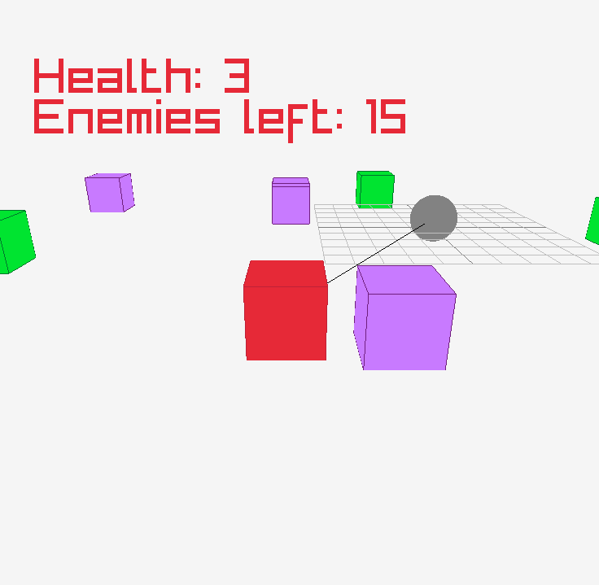

# School Bus of the Dead

> My first raylib attempt at making a game.

## Concept

You are a school bus driver in a zombie apocalypse. Your job is ordinary:
drive kids to and from school. The one catch — the streets are full of zombies.

You plow through (and shoot) zombies on your routes, deliver every kid safely,
and the grateful parents pay you. Use that money to upgrade your bus for the
days ahead.

The game is structured in **days/rounds**. Each day you have a number of kids to
pick up and get home. Once everyone is delivered, the day ends and you spend
your earnings on upgrades for tomorrow. Every new day raises the stakes: more
zombies, new variants, and a world that changes overnight — the bridge you took
yesterday might be broken today.

Zombies can reach the bus and damage it. Be careless and you — and your
passengers — die. Keep everyone alive with upgrades like automatic guns, a
spiked snowplow, or by handing the kids guns of their own.

## Design Pillars (decided scope)

- **Action-first.** The core fun is *driving and slaughtering zombies*. The
  kids and routes are the frame; the moment-to-moment drive is the game.
- **Upgrades are felt, not stats.** Every upgrade visibly changes how the bus
  drives or kills (snowplow, auto-guns, spiked ram, armed kids) — no invisible
  "+5%" bonuses.
- **The day loop is a thin wrapper.** Days give structure and a reason to spend
  money. Briefing → drive → summary/shop → repeat. Kept minimal on purpose.
- **Fixed, handcrafted map.** One designed town, reused each day. "The world
  changed overnight" (broken bridge, blocked road) is a *scripted* variant of
  that map, not procedural generation.

### Scope target

A polished, satisfying playable loop — built as a learning project, aimed at a
**free release on itch.io**. Not commercial.

## Roadmap

Each milestone is a playable vertical slice you can hand to a friend.

1. **Close the loop once** — one kid, fixed school, coins on delivery.
   *(top priority)*
2. **Combat feel pass** — make running over / shooting zombies *feel good*
   before adding more structure. This is the pillar; prove it's fun early.
3. **Make it a day** — N kids, a "day done" condition, a summary screen;
   the game loop returns instead of looping forever.
4. **One driving-changing upgrade** — snowplow or auto-gun: coins → visible
   effect.
5. **Difficulty ramp** — day number → zombie count / speed / variant.
6. **Scripted world-change** — the broken-bridge day. The hook, now cheap
   because the map is fixed.

## Architecture (planned)

Three boxes — *what's loaded*, *what's persisting*, *what's running*:

- **Game / Assets** — loaded once, never reset: map model, zombie mesh, sounds,
  fonts. Owns the window, audio, and the state machine.
- **Session** — one playthrough's live data, shared by every screen, reset only
  on "new game": coins, day number, upgrades owned, the bus.
- **State** — the screen running now (Menu, Driving, Shop, Game Over) plus its
  own throwaway pieces (today's live zombies). Swapped by a `StateManager`.

The game loop is a **state machine**: a screen hands control back instead of
looping forever, and one owner decides what screen runs next.

## Game update

